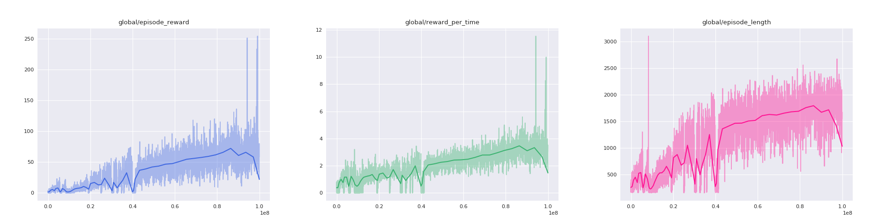

# Tensorboard2Seaborn 🌈
Plot Tensorflow event in a beautiful way (using seaborn actually) instead of using Tensorboard. Currently this repo will plot all the scalars store by ```tf.summary()```.


## Requirement
- Tensorflow
- python 2.7
- matplotlib
- seaborn

## Usage
Read and plot tf event

```
python beautify.py --logdir=./logdir --smooth=100 --color=#4169E1
```
- **logdir**: logdir to event file
- **smooth**: step size for average smoothing
- **color**: pick a color you like :)

## Example
### After
   

### Before


## Reference
- [Tensorboard](https://www.tensorflow.org/get_started/summaries_and_tensorboard)
